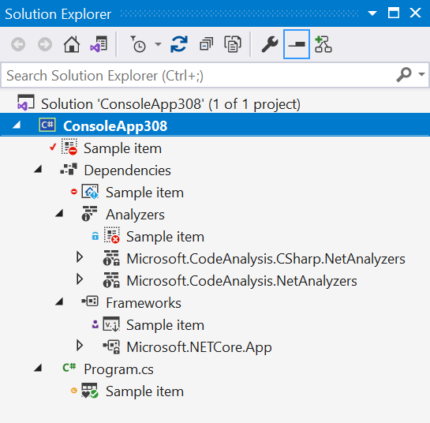

# Attached Collection Sample

This repo contains sample code for extending Visual Studio's Solution Explorer.

Here is a screenshot of a new .NET 5 Console App with this repo's code running. Each "Sample Item" has been added by this code, with random icons/overlays/state icons.

The code contains comments to help understand how to get the most out of these APIs.

When reviewing the code, it makes sense to start with `SampleAttachedCollectionSourceProvider.cs`.